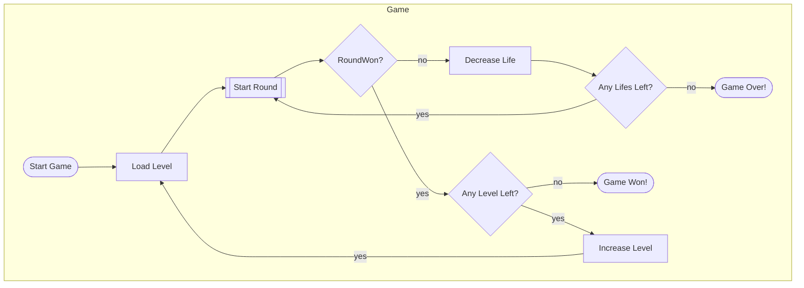
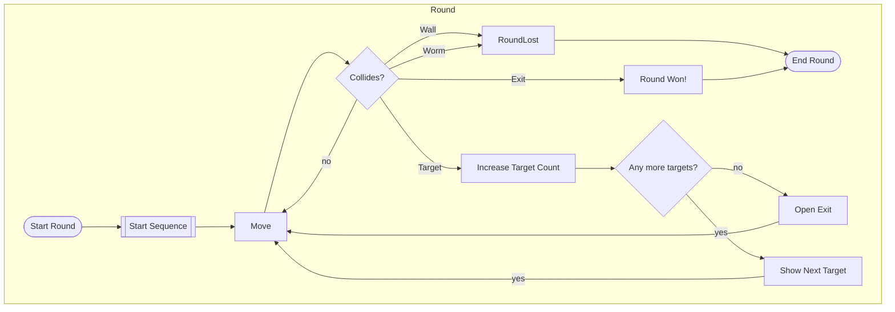

# Mechanics

## Game

<!-- subgraph Round
    startRound{{Start Round}} -.-> blackbox{{???}}
    blackbox -.-> liveLost
    blackbox -.-> roundWon
    liveLost{{Live Lost!}}
    roundWon{{Round Won!}}
end -->

## Round

