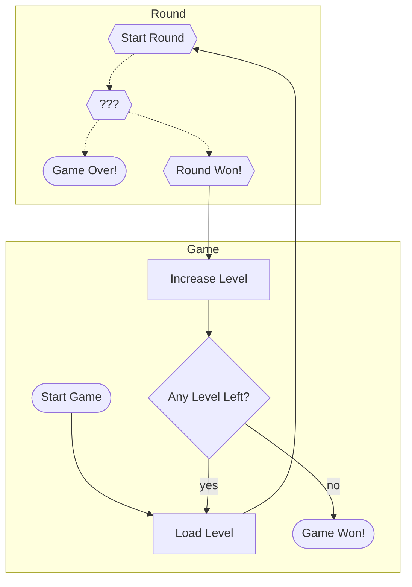
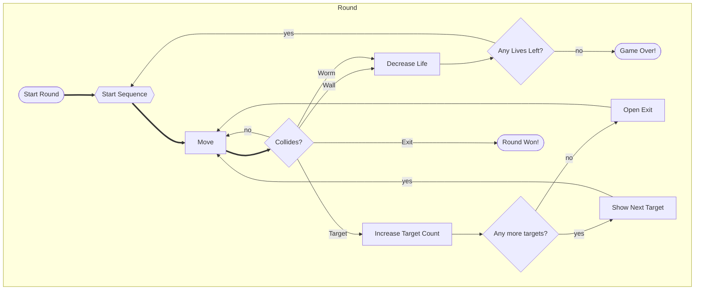

# Mechanics

## Game

```mermaid
flowchart TD
subgraph Round
    startRound{{Start Round}} -.-> blackbox{{???}}
    blackbox -.-> gameOver
    blackbox -.-> roundWon
    gameOver([Game Over!])
    roundWon{{Round Won!}}
end

subgraph Game
    startGame([Start Game]) --> loadLevel[Load Level]
    loadLevel --> startRound
    roundWon --> increaseLevel[Increase Level]
    increaseLevel --> levelLeft{Any Level Left?}
    levelLeft --> |yes| loadLevel
    levelLeft --> |no| gameWon([Game Won!])
end
```

## Round

```mermaid
flowchart TD
subgraph Round
    startRound(["Start Round"]) ==> startSequence{{"Start Sequence"}}
    startSequence ==> move[Move]

    move ==> collides{Collides?}
    collides --> |no| move
    
    collides --> |Wall| decLife
    collides --> |Worm| decLife
    decLife[Decrease Life] --> livesLeft{Any Lives Left?}
    livesLeft --> |yes| startSequence
    livesLeft --> |no| gameOver([Game Over!])
    
    collides --> |Target| incTargetCount[Increase Target Count]
    incTargetCount --> targetsLeft{Any more targets?}
    targetsLeft --> |no| openExit
    openExit["Open Exit"] --> move
    collides ---> |Exit| roundWon([Round Won!])
    targetsLeft --> |yes| showNextTarget[Show Next Target]
    showNextTarget --> |yes| move
end
```